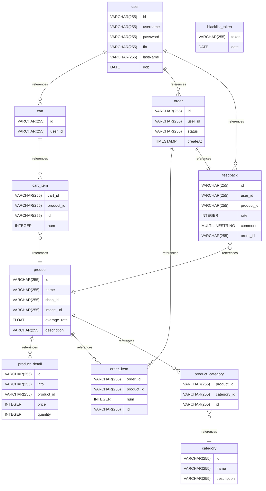

# 🛒 Ecommerce Shop - Spring Boot Project

Dự án web thương mại điện tử đơn giản sử dụng Spring Boot, Maven và MySQL.

---

## 🚀 Build & Run

### ✅ Yêu cầu

- Java 17+
- Maven 3.8+
- MySQL (nếu có sử dụng database)

---

### 🔧 Build Dự Án

```bash
mvn clean install

mvn spring-boot:run
```


chạy ở local thì vào này http://localhost:8080/shop-api/swagger-ui/index.html để xem api hiện có, swagger chưa config đầy đủ, xem tạm thôi


# Database_shop_basic documentation
## Summary

- [Introduction](#introduction)
- [Database Type](#database-type)
- [Table Structure](#table-structure)
	- [user](#user)
	- [product](#product)
	- [cart](#cart)
	- [cart_item](#cart_item)
	- [category](#category)
	- [product_detail](#product_detail)
	- [order](#order)
	- [order_item](#order_item)
	- [product_category](#product_category)
	- [feedback](#feedback)
	- [blacklist_token](#blacklist_token)
- [Relationships](#relationships)
- [Database Diagram](#database-diagram)

## Introduction

## Database type

- **Database system:** MySQL
## Table structure

### user

| Name        | Type          | Settings                      | References                    | Note                           |
|-------------|---------------|-------------------------------|-------------------------------|--------------------------------|
| **id** | VARCHAR(255) | 🔑 PK, not null, unique | fk_user_id_Cart,fk_user_id_order,fk_user_id_Feedback | |
| **username** | VARCHAR(255) | null |  | |
| **password** | VARCHAR(255) | null |  | |
| **firt** | VARCHAR(255) | null |  | |
| **lastName** | VARCHAR(255) | null |  | |
| **dob** | DATE | null |  | | 


### product

| Name        | Type          | Settings                      | References                    | Note                           |
|-------------|---------------|-------------------------------|-------------------------------|--------------------------------|
| **id** | VARCHAR(255) | 🔑 PK, not null, unique | fk_product_id_product_detail,fk_product_id_order_product,fk_product_id_product_category | |
| **name** | VARCHAR(255) | null |  | |
| **shop_id** | VARCHAR(255) | null |  | |
| **image_url** | VARCHAR(255) | null |  | |
| **average_rate** | FLOAT | null |  | |
| **description** | VARCHAR(255) | null |  | | 


### cart

| Name        | Type          | Settings                      | References                    | Note                           |
|-------------|---------------|-------------------------------|-------------------------------|--------------------------------|
| **id** | VARCHAR(255) | 🔑 PK, not null, unique | fk_Cart_id_cart_product | |
| **user_id** | VARCHAR(255) | null |  | | 


### cart_item

| Name        | Type          | Settings                      | References                    | Note                           |
|-------------|---------------|-------------------------------|-------------------------------|--------------------------------|
| **cart_id** | VARCHAR(255) | null |  | |
| **product_id** | VARCHAR(255) | null | fk_cart_product_product_id_product | |
| **id** | VARCHAR(255) | 🔑 PK, null |  | |
| **num** | INTEGER | null |  | | 


### category

| Name        | Type          | Settings                      | References                    | Note                           |
|-------------|---------------|-------------------------------|-------------------------------|--------------------------------|
| **id** | VARCHAR(255) | 🔑 PK, not null, unique |  | |
| **name** | VARCHAR(255) | null |  | |
| **description** | VARCHAR(255) | null |  | | 


### product_detail

| Name        | Type          | Settings                      | References                    | Note                           |
|-------------|---------------|-------------------------------|-------------------------------|--------------------------------|
| **id** | VARCHAR(255) | 🔑 PK, not null, unique |  | |
| **info** | VARCHAR(255) | null |  | |
| **product_id** | VARCHAR(255) | null |  | |
| **price** | INTEGER | null |  | |
| **quantity** | INTEGER | null |  | | 


### order

| Name        | Type          | Settings                      | References                    | Note                           |
|-------------|---------------|-------------------------------|-------------------------------|--------------------------------|
| **id** | VARCHAR(255) | 🔑 PK, not null, unique | fk_order_id_order_product,fk_order_id_Feedback | |
| **user_id** | VARCHAR(255) | null |  | |
| **status** | VARCHAR(255) | null |  | |
| **createAt** | TIMESTAMP | null |  | | 


### order_item

| Name        | Type          | Settings                      | References                    | Note                           |
|-------------|---------------|-------------------------------|-------------------------------|--------------------------------|
| **order_id** | VARCHAR(255) | null, unique |  | |
| **product_id** | VARCHAR(255) | null |  | |
| **num** | INTEGER | null |  | |
| **id** | VARCHAR(255) | 🔑 PK, not null |  | | 


### product_category

| Name        | Type          | Settings                      | References                    | Note                           |
|-------------|---------------|-------------------------------|-------------------------------|--------------------------------|
| **product_id** | VARCHAR(255) | null, unique |  | |
| **category_id** | VARCHAR(255) | null | fk_product_category_category_id_category | |
| **id** | VARCHAR(255) | 🔑 PK, null |  | | 


### feedback

| Name        | Type          | Settings                      | References                    | Note                           |
|-------------|---------------|-------------------------------|-------------------------------|--------------------------------|
| **id** | VARCHAR(255) | 🔑 PK, not null, unique |  | |
| **user_id** | VARCHAR(255) | null |  | |
| **product_id** | VARCHAR(255) | null | fk_Feedback_product_id_product | |
| **rate** | INTEGER | null |  | |
| **comment** | MULTILINESTRING | null |  | |
| **order_id** | VARCHAR(255) | null |  | | 


### blacklist_token

| Name        | Type          | Settings                      | References                    | Note                           |
|-------------|---------------|-------------------------------|-------------------------------|--------------------------------|
| **token** | VARCHAR(255) | 🔑 PK, null |  | |
| **date** | DATE | null |  | | 


## Relationships

- **user to cart**: one_to_many
- **cart to cart_item**: one_to_many
- **cart_item to product**: many_to_one
- **product to product_detail**: one_to_many
- **user to order**: one_to_many
- **order to order_item**: one_to_many
- **product to order_item**: one_to_many
- **product to product_category**: one_to_many
- **product_category to category**: many_to_one
- **user to feedback**: one_to_many
- **feedback to product**: many_to_one
- **order to feedback**: one_to_one

## Database Diagram


